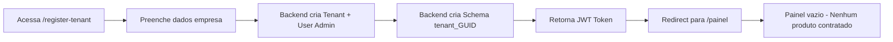
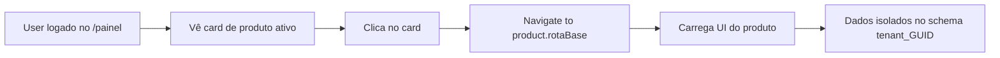

# 📋 Visão Geral do Projeto - Levver.ai RH

## 🎯 Propósito do Projeto

**Levver.ai RH** é uma plataforma SaaS multi-tenant para gestão de Recursos Humanos, projetada para oferecer múltiplos produtos de RH em um único ecossistema integrado.

## 🏗️ Arquitetura Geral

### **Modelo de Negócio: Multi-Produto SaaS**

A plataforma funciona como um **catálogo de produtos**, onde:
- Cada empresa (tenant) pode contratar diferentes produtos
- Produtos são isolados mas compartilham a mesma base de autenticação
- Cobrança por produto contratado (modelo modular)

### **Produtos Disponíveis**

1. **✅ Levver Talents** - Sistema completo de recrutamento e seleção (LANÇADO)
2. **Levver Onboarding** - Integração de novos colaboradores
3. **Levver Ponto** - Controle de ponto eletrônico
4. **Levver Performance** - Avaliação de desempenho
5. **Levver Treinamento** - Gestão de capacitação

## 🏛️ Arquitetura Técnica

### **Backend: .NET 8 Clean Architecture**

```
┌─────────────────────────────────────────────────────┐
│                   LevverRH.WebApp                   │
│              (Controllers + Program.cs)             │
└─────────────────────────────────────────────────────┘
                        ↓
┌─────────────────────────────────────────────────────┐
│              LevverRH.Application                   │
│        (Services, DTOs, Validators, Mappings)       │
└─────────────────────────────────────────────────────┘
                        ↓
┌─────────────────────────────────────────────────────┐
│                LevverRH.Domain                      │
│      (Entities, Interfaces, Events, Exceptions)     │
└─────────────────────────────────────────────────────┘
                        ↓
┌─────────────────────────────────────────────────────┐
│               LevverRH.Infra.Data                   │
│     (DbContext, Repositories, Configurations)       │
└─────────────────────────────────────────────────────┘
```

### **Frontend: React 19 + TypeScript + Vite**

```
┌─────────────────────────────────────────────────────┐
│                  LevverRH.Frontend                  │
│                                                     │
│  ├── features/                                      │
│  │   ├── painel/        (Catálogo de Produtos)    │
│  │   ├── auth/          (Autenticação)            │
│  │   └── [produto]/     (Módulos futuros)         │
│  │                                                  │
│  ├── components/        (Componentes reutilizáveis)│
│  ├── hooks/            (Custom hooks)              │
│  ├── services/         (API clients)               │
│  ├── stores/           (Zustand state)             │
│  └── styles/           (Design System)             │
└─────────────────────────────────────────────────────┘
```

### **Banco de Dados: Azure SQL Server**

**Estratégia de Isolamento: Schema-based Multi-tenancy**

```sql
-- Tabelas Globais (compartilhadas)
shared.users                    -- Usuários de todos os tenants
shared.tenants                  -- Empresas cadastradas
shared.tenant_subscriptions     -- Assinaturas ativas
shared.products_catalog         -- Catálogo de produtos disponíveis
shared.tenant_products          -- Produtos contratados por tenant
shared.white_label              -- Personalização visual
shared.integration_credentials  -- Credenciais de integrações
shared.audit_logs              -- Logs de auditoria

-- Schema por Tenant (dados isolados)
tenant_[GUID].candidatos       -- Dados do produto MST
tenant_[GUID].vagas            -- Dados do produto MST
tenant_[GUID].[outra_tabela]   -- Outros produtos
```

## 🔐 Segurança e Autenticação

### **Duplo Modo de Autenticação**

1. **Email/Senha** - Autenticação tradicional com JWT
2. **Azure AD SSO** - Single Sign-On com Microsoft Entra ID

### **Fluxos de Autenticação**

#### **Fluxo 1: Login Email/Senha**
```
User → Login Page → Backend /api/auth/login 
     → JWT Token → Navigate to /painel
```

#### **Fluxo 2: Azure AD SSO (Tenant Existente)**
```
User → Azure AD → Token → Backend /api/auth/login/azure
     → JWT Token → Navigate to /painel
```

#### **Fluxo 3: Azure AD SSO (Novo Tenant)**
```
User → Azure AD → Token → Backend /api/auth/login/azure
     → Partial JWT → Navigate to /register-tenant?mode=sso
     → Complete Setup → Backend /api/auth/complete-tenant-setup
     → Full JWT Token → Navigate to /painel
```

### **Proteção de Rotas**

- **ProtectedRoute Component**: Valida `isAuthenticated` e `token` do Zustand
- **API Interceptor**: Adiciona `Bearer {token}` em todas as requisições
- **Backend Authorization**: `[Authorize]` attributes em controllers

## 🎨 Design System - Levver.ai

### **Cores Oficiais**

```css
Purple:    #A417D0  (Cor primária da marca)
Dark:      #11005D  (Texto e fundos escuros)
Light:     #FBFBFF  (Backgrounds claros)
Lavender:  #D4C2F5  (Secundária/destaque)
Gray:      #EAEAF0  (Bordas e divisores)
Error:     #E84358  (Erros e alertas)
```

### **Implementação**

- **CSS Variables**: `levver-design-system.css` (variáveis globais)
- **TypeScript Tokens**: `levver-theme.ts` (cores programáticas)
- **Utilitários**: Funções helper para manipulação de cores

## 📊 Modelo de Dados Principal

### **Entidade: ProductCatalog (Catálogo de Produtos)**

```csharp
Id: Guid
ProdutoNome: string             // "Levver MST"
Descricao: string               // Descrição do produto
Categoria: string               // "Recrutamento", "Ponto", etc.
Icone: string                   // Emoji ou classe CSS
CorPrimaria: string             // #A417D0
RotaBase: string                // "/mst", "/ponto"
OrdemExibicao: int              // Ordem no painel
Lancado: bool                   // true = disponível, false = em breve
ModeloCobranca: enum            // Mensal, Anual, Unico, Uso
ValorBasePadrao: decimal        // Preço padrão
Ativo: bool
```

### **Entidade: TenantProduct (Produtos Contratados)**

```csharp
Id: Guid
TenantId: Guid                  // FK -> Tenant
ProductId: Guid                 // FK -> ProductCatalog
Ativo: bool                     // Produto ativo para este tenant?
DataAtivacao: DateTime?
DataDesativacao: DateTime?
ConfiguracaoJson: string?       // Configurações específicas (JSON)
```

### **Relação N:N com Propriedades**

```
Tenant (1) ──────< TenantProduct (N) >────── (N) ProductCatalog
           \                                /
            \                              /
             \                            /
              Quais produtos o tenant    Quais tenants têm
              tem contratados?           este produto?
```

## 🚀 Fluxo da Aplicação

### **1. Onboarding de Novo Tenant**



### **2. Contratação de Produto (Futuro)**

```mermaid
graph LR
    A[Admin no /painel] --> B[Clica em produto "Em Breve"]
    B --> C[Modal de contratação]
    C --> D[Escolhe plano/período]
    D --> E[Payment Gateway]
    E --> F[Backend cria TenantProduct]
    F --> G[Backend cria TenantSubscription]
    G --> H[Produto aparece no /painel]
    H --> I[User clica e acessa produto]
```

### **3. Acesso a Produto Contratado**



## 🛠️ Stack Tecnológica

### **Backend**
- **.NET 8** (LTS)
- **ASP.NET Core Web API**
- **Entity Framework Core 8.0.21**
- **FluentValidation** (validação de DTOs)
- **AutoMapper** (mapeamento de objetos)
- **JWT Bearer Authentication**
- **Microsoft Identity** (Azure AD integration)

### **Frontend**
- **React 19.1** (latest)
- **TypeScript 5.7**
- **Vite 6.0** (build tool)
- **React Router 6** (navegação)
- **Zustand** (state management)
- **Axios** (HTTP client)
- **React Hot Toast** (notificações)

### **Database**
- **Azure SQL Server**
- **Schema-based Isolation**

### **DevOps**
- **Git** (controle de versão)
- **Azure DevOps** (planejamento)
- **Azure App Service** (hospedagem backend)
- **Azure Static Web Apps** (hospedagem frontend)

## 📁 Estrutura de Pastas (Resumo)

```
Levver-RH-ai/
├── LevverRH.Domain/              # Entidades, Interfaces, Regras de Negócio
├── LevverRH.Application/         # Casos de Uso, DTOs, Validators
├── LevverRH.Infra.Data/          # EF Core, Repositories, Migrations
├── LevverRH.Infra.IoC/           # Dependency Injection
├── LevverRH.WebApp/              # Controllers, Program.cs
└── LevverRH.Frontend/            # React App
    ├── src/
    │   ├── features/painel/      # 🎯 Catálogo de Produtos
    │   ├── components/           # Componentes reutilizáveis
    │   ├── hooks/                # useAuth, etc.
    │   ├── services/             # API clients
    │   ├── stores/               # Zustand (authStore)
    │   ├── styles/               # Design System
    │   └── routes/               # AppRoutes, ProtectedRoute
    └── public/
```

## 🎯 Estado Atual do Projeto

### ✅ **Implementado**
- [x] Arquitetura Clean Architecture completa
- [x] Autenticação Email/Senha
- [x] Autenticação Azure AD SSO
- [x] Multi-tenancy com schema isolation
- [x] Catálogo de Produtos (ProductCatalog)
- [x] Relação Tenant-Produto (TenantProduct)
- [x] Painel Principal (Dashboard de Produtos)
- [x] Design System Levver.ai
- [x] Protected Routes
- [x] Migrations para banco de dados
- [x] API de Produtos (/api/products)
- [x] **Produto Levver Talents** (primeiro produto COMPLETO)
  - [x] Backend completo (6 entidades, 4 enums, controllers, services)
  - [x] Frontend Dashboard com métricas em tempo real
  - [x] Integração sidebar com navegação
  - [x] API endpoints para vagas, candidaturas, entrevistas
  - [x] **Criação de Vagas Assistida por IA** (OpenAI GPT-4o-mini)
    - [x] Chat conversacional para coleta de requisitos
    - [x] Extração inteligente de campos da vaga
    - [x] Geração automática de descrições profissionais
    - [x] Histórico de conversa persistente
    - [x] Edição manual de campos com atualização contextual da IA
  - [x] **Gestão Completa de Vagas**
    - [x] CRUD completo de vagas
    - [x] Listagem com filtros por status
    - [x] Publicação/despublicação de vagas
    - [x] Detalhamento completo de requisitos
  - [x] **Aplicação Pública de Candidatos**
    - [x] Formulário público de candidatura (/public/jobs/:id/apply)
    - [x] Upload de currículo (PDF)
    - [x] Criação automática de conta de candidato
    - [x] Auto-login após aplicação
    - [x] Validação de campos e sanitização
  - [x] **Análise de Currículos com IA** (OpenAI GPT-4o)
    - [x] Extração de texto de PDF (PdfPig)
    - [x] Análise comparativa currículo vs requisitos da vaga
    - [x] Scoring automático (0-100)
    - [x] Justificativa detalhada da análise
    - [x] Identificação de pontos fortes e atenção
    - [x] Rastreamento de custos (tokens + estimativa)

### 🚧 **Em Desenvolvimento**
- [ ] Páginas de gestão avançada de candidatos
- [ ] Pipeline Kanban de recrutamento
- [ ] Relatórios e analytics avançados
- [ ] Sistema de notificações por email

### 📋 **Próximos Passos**
- [ ] Expansão Levver Talents (filtros avançados, kanban)
- [ ] Sistema de cobrança/pagamento
- [ ] Segundo produto (Levver Ponto)
- [ ] Dashboard de analytics consolidado
- [ ] Gestão de usuários por tenant
- [ ] Permissões e roles avançadas

## 🔗 Links Úteis

- **Repository**: GitHub - PietroAlkmin/Levver-RH-ai
- **Branch Atual**: feat/logica-produto
- **Database**: levver.ai-RH-DEV (Azure SQL)
- **Frontend URL**: http://localhost:5173
- **Backend URL**: http://localhost:5113

---

**Última Atualização**: 30 de Novembro de 2025
**Versão**: 1.0.0-beta
