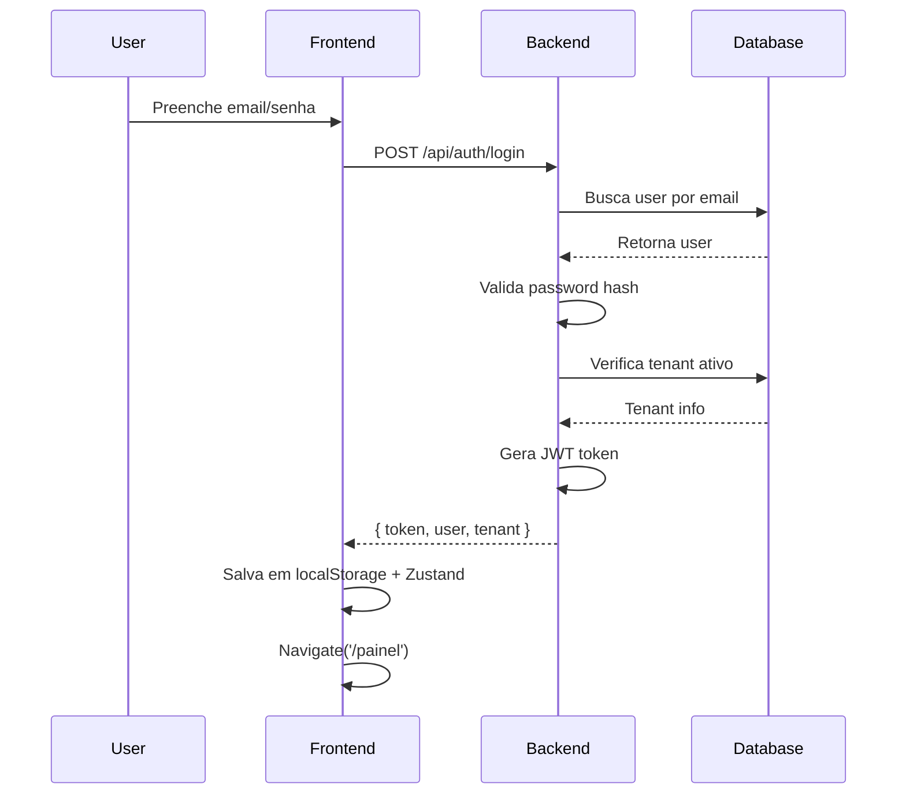
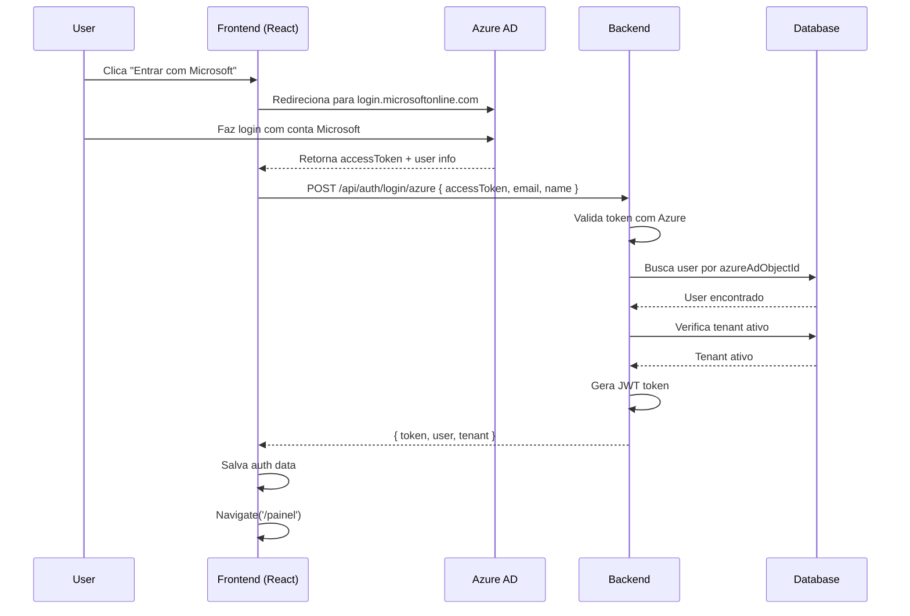
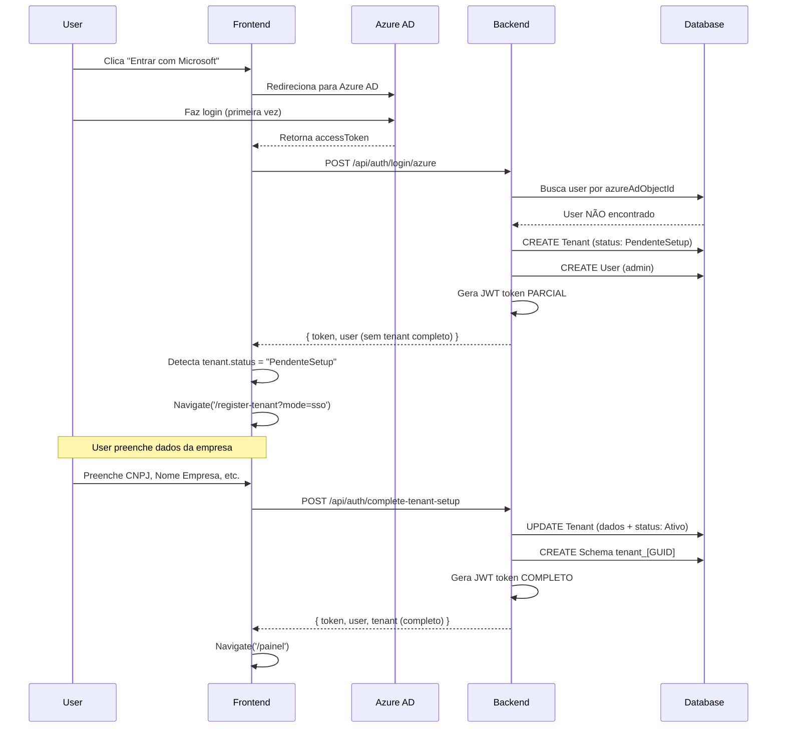

# 🔐 Sistema de Autenticação - Levver.ai RH

## 🎯 Visão Geral

O sistema suporta **dois métodos de autenticação**:
1. **Email/Senha** - Autenticação tradicional
2. **Azure AD SSO** - Single Sign-On com Microsoft Entra ID

## 🔑 Fluxos de Autenticação

### **1. Login com Email/Senha**



#### **Request/Response**

**POST** `/api/auth/login`
```json
// Request
{
  "email": "admin@empresa.com",
  "password": "Senha@123"
}

// Response (Success)
{
  "success": true,
  "message": "Login realizado com sucesso",
  "data": {
    "token": "eyJhbGciOiJIUzI1NiIsInR5cCI6IkpXVCJ9...",
    "user": {
      "id": "guid",
      "nome": "Admin User",
      "email": "admin@empresa.com",
      "role": "Admin",
      "authType": "EmailSenha"
    },
    "tenant": {
      "id": "guid",
      "nomeEmpresa": "Empresa LTDA",
      "status": "Ativo"
    },
    "whiteLabel": {
      "primaryColor": "#A417D0",
      "systemName": "Levver RH"
    }
  }
}
```

---

### **2. Login com Azure AD (Tenant Existente)**



#### **Request/Response**

**POST** `/api/auth/login/azure`
```json
// Request
{
  "accessToken": "eyJ0eXAiOiJKV1QiLCJhbGc...",
  "email": "usuario@empresa.com",
  "name": "João Silva",
  "azureAdObjectId": "12345678-1234-1234-1234-123456789abc"
}

// Response (Success - Tenant Existente)
{
  "success": true,
  "message": "Login realizado com sucesso",
  "data": {
    "token": "eyJhbGciOiJIUzI1NiIsInR5cCI6IkpXVCJ9...",
    "user": { ... },
    "tenant": { ... },
    "whiteLabel": { ... }
  }
}
```

---

### **3. Login com Azure AD (Novo Tenant - Setup Necessário)**



#### **Request/Response**

**POST** `/api/auth/login/azure` (primeira vez)
```json
// Response (Success - Setup Necessário)
{
  "success": true,
  "message": "Tenant criado. Complete o cadastro.",
  "data": {
    "token": "eyJhbGciOiJIUzI1NiIsInR5cCI6IkpXVCJ9...",  // Token parcial
    "user": {
      "id": "guid",
      "nome": "João Silva",
      "email": "joao@empresa.com",
      "role": "Admin"
    },
    "tenant": {
      "id": "guid",
      "status": "PendenteSetup",  // ⚠️ Frontend detecta isso
      "nomeEmpresa": null
    }
  }
}
```

**POST** `/api/auth/complete-tenant-setup`
```json
// Request
{
  "NomeEmpresa": "Empresa LTDA",
  "Cnpj": "12.345.678/0001-90",
  "EmailEmpresa": "contato@empresa.com",
  "TelefoneEmpresa": "(11) 98765-4321",
  "EnderecoEmpresa": "Rua Exemplo, 123"
}

// Response (Success)
{
  "success": true,
  "message": "Setup concluído com sucesso",
  "data": {
    "token": "eyJhbGciOiJIUzI1NiIsInR5cCI6IkpXVCJ9...",  // Token completo
    "user": { ... },
    "tenant": {
      "id": "guid",
      "status": "Ativo",  // ✅ Agora ativo
      "nomeEmpresa": "Empresa LTDA",
      "cnpj": "12.345.678/0001-90"
    },
    "whiteLabel": { ... }
  }
}
```

---

## 🎫 JWT Token Structure

### **Claims no Token**

```json
{
  "sub": "user-guid",                    // User ID
  "email": "usuario@empresa.com",        // Email do usuário
  "name": "João Silva",                  // Nome do usuário
  "role": "Admin",                       // Role (Admin, Manager, User)
  "TenantId": "tenant-guid",             // ID do tenant
  "TenantName": "Empresa LTDA",          // Nome da empresa
  "TenantStatus": "Ativo",               // Status do tenant
  "AuthType": "AzureAd",                 // Tipo de auth usado
  "nbf": 1699999999,                     // Not Before
  "exp": 1700086399,                     // Expiration (24 horas)
  "iat": 1699999999,                     // Issued At
  "iss": "LevverRH",                     // Issuer
  "aud": "LevverRH"                      // Audience
}
```

### **Validação no Backend**

```csharp
// Program.cs
builder.Services.AddAuthentication(JwtBearerDefaults.AuthenticationScheme)
    .AddJwtBearer(options =>
    {
        options.TokenValidationParameters = new TokenValidationParameters
        {
            ValidateIssuer = true,
            ValidateAudience = true,
            ValidateLifetime = true,
            ValidateIssuerSigningKey = true,
            ValidIssuer = "LevverRH",
            ValidAudience = "LevverRH",
            IssuerSigningKey = new SymmetricSecurityKey(
                Encoding.UTF8.GetBytes(configuration["Jwt:SecretKey"])
            ),
            ClockSkew = TimeSpan.Zero  // Remove 5 min default tolerance
        };
    });
```

### **Uso em Controllers**

```csharp
[HttpGet("my-products")]
[Authorize] // ⬅️ Requer token válido
public async Task<IActionResult> GetMyProducts()
{
    // Extrai TenantId do token
    var tenantId = Guid.Parse(User.FindFirst("TenantId")?.Value);
    
    var products = await _productService.GetMyProductsAsync(tenantId);
    return Ok(new { Success = true, Data = products });
}
```

---

## 🔒 Segurança

### **1. Password Hashing (Email/Senha)**

```csharp
public class PasswordHasher : IPasswordHasher
{
    public string HashPassword(string password)
    {
        // Usa BCrypt com salt automático
        return BCrypt.Net.BCrypt.HashPassword(password, workFactor: 12);
    }

    public bool VerifyPassword(string password, string hash)
    {
        return BCrypt.Net.BCrypt.Verify(password, hash);
    }
}
```

**⚠️ Importante:**
- Nunca armazene senhas em texto plano
- Use `BCrypt`, `PBKDF2` ou `Argon2`
- Work factor de pelo menos 12

---

### **2. Validação de Token Azure AD**

```csharp
public class AzureAdTokenValidator
{
    public async Task<ClaimsPrincipal> ValidateTokenAsync(string accessToken)
    {
        var httpClient = new HttpClient();
        var response = await httpClient.GetAsync(
            "https://graph.microsoft.com/v1.0/me",
            new AuthenticationHeaderValue("Bearer", accessToken)
        );

        if (!response.IsSuccessStatusCode)
        {
            throw new UnauthorizedException("Token Azure AD inválido");
        }

        var userInfo = await response.Content.ReadFromJsonAsync<AzureUserInfo>();
        
        // Cria ClaimsPrincipal com dados do Azure
        var claims = new List<Claim>
        {
            new Claim(ClaimTypes.Email, userInfo.Mail),
            new Claim(ClaimTypes.Name, userInfo.DisplayName),
            new Claim("azureAdObjectId", userInfo.Id)
        };

        return new ClaimsPrincipal(new ClaimsIdentity(claims, "AzureAd"));
    }
}
```

---

### **3. Proteção contra CSRF**

**Frontend:**
```typescript
// apiClient já inclui automaticamente o token
apiClient.interceptors.request.use((config) => {
  const token = localStorage.getItem('token');
  if (token) {
    config.headers.Authorization = `Bearer ${token}`;
  }
  return config;
});
```

**Backend:**
```csharp
// CORS configurado para aceitar apenas origins específicas
builder.Services.AddCors(options =>
{
    options.AddPolicy("AllowFrontend", policy =>
    {
        policy.WithOrigins("http://localhost:5173", "https://app.levver.ai")
            .AllowAnyHeader()
            .AllowAnyMethod()
            .AllowCredentials();
    });
});
```

---

### **4. Rate Limiting (Anti-Brute Force)**

```csharp
// Program.cs
builder.Services.AddRateLimiter(options =>
{
    options.AddFixedWindowLimiter("login", opt =>
    {
        opt.Window = TimeSpan.FromMinutes(1);
        opt.PermitLimit = 5;  // Máx 5 tentativas por minuto
    });
});

// AuthController.cs
[HttpPost("login")]
[EnableRateLimiting("login")]
public async Task<IActionResult> Login([FromBody] LoginRequestDTO request)
{
    // ...
}
```

---

## 🧪 Fluxo de Teste

### **Cenário 1: Login Email/Senha**

```bash
# 1. Registrar novo tenant
POST http://localhost:5113/api/auth/register/tenant
{
  "nomeEmpresa": "Teste LTDA",
  "cnpj": "12.345.678/0001-90",
  "emailEmpresa": "teste@teste.com",
  "nomeAdmin": "Admin Teste",
  "emailAdmin": "admin@teste.com",
  "senhaAdmin": "Senha@123"
}

# 2. Fazer login
POST http://localhost:5113/api/auth/login
{
  "email": "admin@teste.com",
  "password": "Senha@123"
}

# 3. Usar token para acessar recursos
GET http://localhost:5113/api/products/my-products
Authorization: Bearer {token}
```

---

### **Cenário 2: Login Azure AD (Novo Tenant)**

```bash
# 1. Frontend faz login no Azure e recebe accessToken

# 2. Enviar token para backend
POST http://localhost:5113/api/auth/login/azure
{
  "accessToken": "eyJ0eXAiOiJKV1QiLCJhbGc...",
  "email": "usuario@empresa.com",
  "name": "João Silva",
  "azureAdObjectId": "12345678-1234-1234-1234-123456789abc"
}

# Response: { tenant: { status: "PendenteSetup" } }

# 3. Completar setup
POST http://localhost:5113/api/auth/complete-tenant-setup
Authorization: Bearer {partial-token}
{
  "NomeEmpresa": "Empresa LTDA",
  "Cnpj": "12.345.678/0001-90",
  "EmailEmpresa": "contato@empresa.com"
}

# 4. Usar token completo
GET http://localhost:5113/api/products/my-products
Authorization: Bearer {full-token}
```

---

## 🛡️ Best Practices Implementadas

✅ **Tokens com expiração** (24 horas)  
✅ **Refresh token** (TODO - implementar)  
✅ **HTTPS obrigatório em produção**  
✅ **CORS restritivo**  
✅ **Rate limiting em endpoints sensíveis**  
✅ **Password hashing com BCrypt**  
✅ **Validação de tokens Azure AD**  
✅ **Claims baseadas em roles**  
✅ **Logout limpa tokens do cliente**  
✅ **Interceptors para adicionar token automaticamente**  
✅ **Redirect automático em 401 Unauthorized**  

---

## 🔄 Diagrama de Estados - Tenant

```
┌─────────────────┐
│  Novo Tenant    │
│  (não existe)   │
└────────┬────────┘
         │
         │ Azure AD Login (primeira vez)
         ▼
┌─────────────────┐
│ PendenteSetup   │ ◄─── Token parcial gerado
│  (tenant criado │      User precisa completar dados
│   mas vazio)    │
└────────┬────────┘
         │
         │ POST /complete-tenant-setup
         ▼
┌─────────────────┐
│     Ativo       │ ◄─── Token completo gerado
│  (tenant pronto │      Pode acessar produtos
│   para uso)     │
└────────┬────────┘
         │
         │ Admin cancela assinatura
         ▼
┌─────────────────┐
│    Suspenso     │ ◄─── Login bloqueado
│  (não pode      │      Mensagem: "Assinatura suspensa"
│   acessar)      │
└─────────────────┘
```

---

**Última Atualização**: 30 de Novembro de 2025
